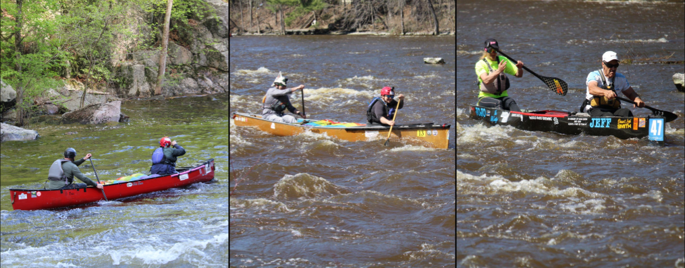

Downriver racing is a sport where competitors take their watercraft (usually a canoe, kayak, or stand-up paddle board) down a race course in competition with other paddlers. The General Clinton Canoe Regatta (nicknamed "the 70-miler") is a prominent race in the sport that has been running since the 1960s. The race is a 63 mile course down the Susquehanna River in New York (from Cooperstown to Bainbridge). Paddlers compete against each other to achieve the fastest time in their class, with the fastest boats finishing about 7-8 hours after they start. 

Completing this race is an impressive feat, and this combined with the race’s fame means there is usually high attendance. However, unlike most races, where the turnout is mostly recreational paddlers, the difficulty of this race means that most paddlers at the General Clinton are pros. This phenomenon has interesting impacts on data from the race.

```{r message = FALSE, warning = FALSE}
library(readr)
library(dplyr)
library(ggplot2)

clinton_full <- read_csv("full_clinton.csv")
```

Each row in this data set represents a specific paddler from a year of the Clinton (so if a boat has more than one paddler, its time and bib number will appear in the same number of rows as there were people in the boat). This data set contains results from 2014-2025 (excluding 2020 and 2021, when the race was cancelled due to the Covid-19 Pandemic).

#### 1. For ease of understanding, modify the data set so the first columns are `displayName` and `bib` number. The order after that does not matter.

#### 2. Using the fact that each bib number is only assigned to one boat per year, modify the data set to only include each boat/team once (rather than including each racer in a boat/team)

#### 3. Make a horizontal bar graph comparing counts of the different classes.

##### 3.1. Change the color and fill of the bars to any combination you like.

#### 4. From 2014-2019, the Clinton tracked teams who registered but did not start or did not finish the race by marking them as DNS or DNF, which is entered under 'status' in the data. All teams that completed the race were given an `NA` for this variable. Modify the data set to only include teams with an `NA` under `status`.

#### 5. Make a histogram showing the distribution of times.

##### 5.1. Change the number of bins (test out a few options!)

#### Four common classes at the Clinton are `oc2pro`, `oc2rec`, `oc2stock`, and `oc2cruiser`. These classes are all tandem (2 person) canoes of various types. Depending on the class, there are different specs the boats are expected to be within.

* Rec boats are shortest and heaviest
* Stock boats are longer but taller/deeper
* Pro and cruising boats are long and shallow and have very few differences (the choice between the two is mostly attributed to the racer's goal with the race)
  + Cruisers are more laid back than the pros. 
    
The picture below shows an example of (in order) a rec boat, a stock boat, and a pro (or cruiser) boat.



#### 7. Create a version of the data set that only includes the classes mentioned above.

#### 8. With the new dataset, make boxplots showing time distribution for each class. What do the plots tell you?
