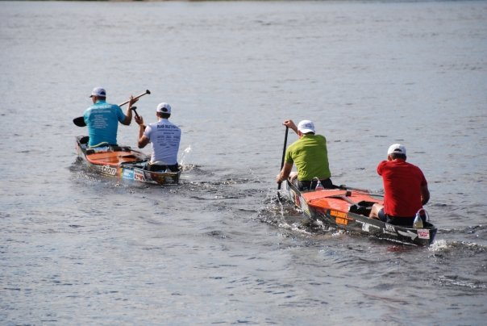

<!--
{width="3in"}
-->

## Module

Please note that these material have not yet completed the required pedagogical and industry peer-reviews to become a published module on the SCORE Network. However, instructors are still welcome to use these materials if they are so inclined.

### Introduction

The [Clinton Canoe Regatta](https://www.canoeregatta.org/){target="_blank"} (the 70-miler) is an annual event in the downriver canoeing community. This race is one leg of the [Canoeing Triple Crown](https://www.ausablecanoemarathon.org/stats-and-history/triple-crown/){target="_blank"} (a challenge made up of three marathon canoe races in North America) and spans about 63 miles on the Susquehanna River in New York, from Cooperstown to Bainsbridge. Paddlers compete against each other to achieve the fastest time in their class.

### Background Video

For those interested in learning more about canoe racing, watch this informative and humorous video from AuSable River Canoe Marathon competitor Holly Reynolds - "I am a canoe racer, explaining canoe racing."

<iframe width="560" height="315" src="https://www.youtube.com/embed/gCF9eyOrfn0?si=ZSfNbjKQM0Az61uz" title="YouTube video player" frameborder="0" allow="accelerometer; autoplay; clipboard-write; encrypted-media; gyroscope; picture-in-picture; web-share" referrerpolicy="strict-origin-when-cross-origin" allowfullscreen>

</iframe>

::: {.callout-note collapse="true" title="Activity Length" appearance="minimal"}
This could serve as an in class activity and should take roughly a half an hour to complete.
:::

::: {.callout-note collapse="true" title="Learning Objectives" appearance="minimal"}
By the end of this activity, students will:

1.  Increase ability to create different plots.

2.  Learn more about filtering to include specific observations.

3.  Be able to notice and fix issues in data.
:::

::: {.callout-note collapse="true" title="Methods" appearance="minimal"}
Students should have introductory experience with both creating graphs and subsetting data.
:::

::: {.callout-note collapse="true" title="Technology Requirements" appearance="minimal"}
Students will need to use technology that supports creation of graphs and filtering of data. Solutions are provided using the `dplyr` and `ggplot2` packages from `R`. However, any software capable of subsetting (filtering) rows and graphing distributions.
:::

### Data

This activity uses the data set: [full_clinton.csv](full_clinton.csv)

The `full_clinton.csv` data set includes data from [Paddlestats](https://paddlestats.net/racehistory/CLINTON70){target="_blank"} about the [Clinton Canoe Regatta](https://www.canoeregatta.org/){target="_blank"} from the years 2014-2025 (excluding 2020 and 2021 as no race was held due to the COVID-19 pandemic). Each row refers to a specific racer from a year at the race (so if a boat has more than one paddler, its time and bib number will appear in the same number of rows as there were people in the boat).

There are 3,227 total paddlers with 19 variables for each one. If a paddler did the race multiple times from 2014-2025, they will have a row for each year they ran it.

<b>Variable Descriptions</b>

| Variable    | Description                                               |
|-------------|-----------------------------------------------------------|
| year        | Year raced                                                |
| boatType    | Type of boat raced (canoe, kayak, SUP)                    |
| bib         | Bib number                                                |
| classID     | Class (oc4stock, oc2pro, etc)                             |
| place       | Where the boat placed in their class's results            |
| time        | The time to complete the race (in sec)                    |
| overall     | Overall rank (out of all boats ever)                      |
| byBoat      | Rank out of all boats of the same type                    |
| byClass     | Rank out of all boats in class (all years)                |
| byYrClass   | Rank out of the boats in their class in their year        |
| byYrOver    | Rank out of all the boats that year (all classes)         |
| byYrBoat    | Rank out of all boats of the same type that year          |
| courseID    | Version of the course raced (all the same here)           |
| personID    | The person's PaddleStats ID                               |
| displayName | Name of the racer                                         |
| city        | Racer's home city (as given at registration)              |
| state       | Racer's home state or province (as given at registration) |
| country     | Racer's home country (as given at registration)           |
| status      | Finishing status (DNF, DNS, DQ, etc.)                     |

#### Data Source

The data are compiled from the [Paddlestats Website](https://paddlestats.net/racehistory/CLINTON70){target="_blank"}.

### Materials

-   [Module Worksheet (R Version)](clinton_module_worksheet.qmd)

-   [Module Worksheet (non-R Version)](Clinton_Graphing_Manipulation.docx)

-   [Solutions to Worksheet (R/Quarto Version)](clinton_module_SOLUTIONS.qmd)

-   [Solutions to Worksheet (R/PDF Version)](clinton_module_SOLUTIONS.pdf)

::: {.callout-note collapse="true" title="Conclusion" appearance="minimal"}
Upon conclusion of this module, students will have a greater understanding of data manipulation and visualization and will be better prepared to use both with less clear-cut data.
:::
