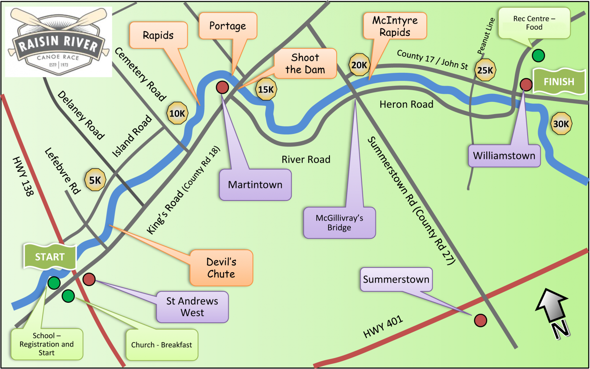

## Module

Please note that these materials have not yet completed the required pedagogical and industry peer-reviews to become a published module on the SCORE Network. However, instructors are still welcome to use these materials if they are so inclined.

## Introduction

Each year, the Raisin Region Conservation Authority (RRCA) holds the Raisin River Race. This race is one of the longest races in Eastern Ontario, spanning almost 19 miles (30 km) on the Raisin River, from St. Andrews West to Williamstown. Paddlers compete against each other to achieve the fastest time in their class. Classes vary by the years and are split up based on boat type and paddler/s.

::: {.callout-note collapse="true" title="Map of Raisin River Route" appearance="minimal"}

:::

The Raisin River Race can be paddled by canoes or kayaks, but stand-up paddleboards are not permitted.

### Background Video

For those interested in learning more about canoe racing, watch this informative and humorous video from AuSable River Canoe Marathon competitor Holly Reynolds - "I am a canoe racer, explaining canoe racing."

<iframe width="560" height="315" src="https://www.youtube.com/embed/gCF9eyOrfn0?si=ZSfNbjKQM0Az61uz" title="YouTube video player" frameborder="0" allow="accelerometer; autoplay; clipboard-write; encrypted-media; gyroscope; picture-in-picture; web-share" referrerpolicy="strict-origin-when-cross-origin" allowfullscreen>

</iframe>

::: {.callout-note collapse="true" title="Activity Length" appearance="minimal"}
This could serve as an in class activity and should take roughly a half an hour to complete. 
:::

::: {.callout-note collapse="true" title="Learning Objectives" appearance="minimal"}
By the end of this activity, students will:

1. Increase ability to find and investigate outliers in a dataset.  

2. Be able remove influential observations from a dataset.

:::

::: {.callout-note collapse="true" title="Methods" appearance="minimal"}

Students should have knowledge of how to fit linear regression models and familiarity with the measures of unusualness/influence. Students should also be able to modify data sets to remove unwanted observations.

:::

::: {.callout-note collapse="true" title="Technology Requirements" appearance="minimal"}

Students will need to use R or other stat software like Minitab.

:::

## Data

This activity uses the data set: [raisin_river_DNF.csv](raisin_river_DNF.csv)

The `raisin_river_DNF.csv` data set includes data from Paddlestats and the Raisin River Race website about the Raisin River Race from the years 2015-2025 (excluding 2020 and 2021 as no race was held due to the COVID-19 pandemic and 2019 due to incomplete finish status data). Each row contains the year, the flow from that year, and the proportion of DNFs from that year (calculated by dividing number of DNFs by total number of participants). 

<b>Variable Descriptions</b>

| Variable      | Description                                     |
|---------------|-------------------------------------------------|
| year          | Year of Raisin River Race                       |
| prop_DNF     | The ratio of DNFs at the race.                  |
| flow          | The flow of the water for that year             |

### Data Source

The data are compiled from the [Paddlestats Website](https://paddlestats.net/racehistory/RAISIN){target="_blank"} and the [Raisin River Race Website](https://rrca.on.ca/page.php?id=13){target="_blank"}. This data set is a pared down version of the [`raisin_river_full.csv`](https://data.scorenetwork.org/water_sports/canoe_racing_raisin_river.html){target="_blank"} file from the SCORE Data Repository.

## Materials

- [Module Worksheet (R Version)](raisin_river_module_worksheet.qmd)

- [Module Worksheet (Other Software Version)]("RaisinRiver_Module_Worksheet") 

- [Solutions to Worksheet (R/Quarto Version)](raisin_river_module_SOLUTIONS.qmd)

- [Solutions to Worksheet (PDF)](raisin_river_module_SOLUTIONS.pdf)

::: {.callout-note collapse="true" title="Conclusion" appearance="minimal"}
Upon conclusion of this module, students will have an understanding of how to detect outliers in their data set, the influence these observations can have, and how to remove them if appropriate.
:::
