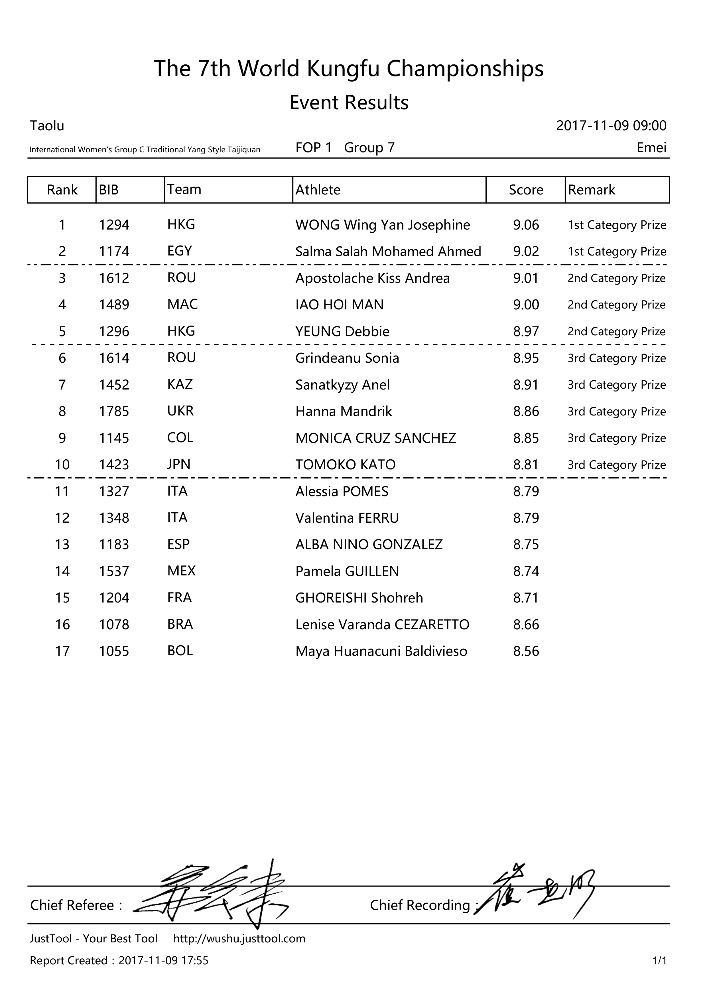
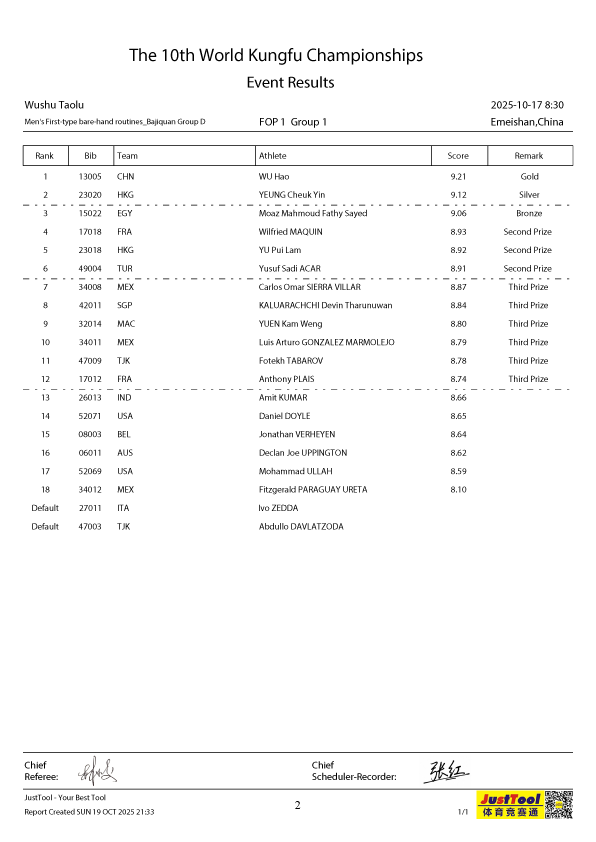

::: {.callout-note title="Notice" appearance="simple"}
Please note that these materials have not yet completed the required
pedagogical and industry peer-reviews to become a published module on
the SCORE Network. However, instructors are still welcome to use these
materials if they are so inclined.
:::


## Background

The World Kung Fu Championships (WKFC), hosted by the International Wushu Federation (IWUF), is an international level sporting event established in 2004 to propagate the development of wushu around the world. As there are dozens of Kung Fu (traditional wushu) styles represented in the WKFC, these championships offer a unique platform for thousands of practitioners of all ages and varying skill levels to come together every two years.\


::: {.callout-note collapse="true" title="Learning Objectives" appearance="minimal"}
-   Learn about the process of scraping data from a pdf file.
-   Learn a method to parse the data into a format usable for data analysis.
-   Learn processes for data cleaning.
-   Learn about dealing with missing data cases through data imputation.
-   Use web resources efficiently to clean and format data for analysis and exploration.
:::


#### Data:

The data for this specific module come from the Result Books of the World Kung Fu Championships (WKFC) as they are readily available online on the [International Wushu Federation's website](https://www.iwuf.org/en/competition-results/index.html). On this website and for this competition in particular, public users have access to the result books from the 7th edition of the championship (2017) until the most recent, 10th edition (2025) championship.\
\
The format of the result books is generally similar although not the same. Below we identify their distinguishing features:
\
**7th**\

[7th World Kungfu Championships, 2017](https://www.iwuf.org/wp-content/uploads/2018/12/7th-World-Kungfu-Championships-Regulations.pdf)

The 7th edition of the competition divided age categories in only 5 groups, as opposed to 6 categories like in the following years' result books.\


**8th**\
[8th World Kungfu Championships, 2019](https://iwuf.org/wp-content/uploads/2019/06/8th-WKFC-Program-Book-International-Group.pdf)

For this edition the result book is separated into the International group and the Domestic Group. The domestic group (Chinese Mainland athletes) is relatively the same size as the international group.

**9th**\
[9th World Kungfu Championships, 2023](https://www.iwuf.org/wp-content/uploads/2023/09/9th-WKFC-Results-Book-境外组.pdf)

For this edition the result book is separated into the International group and the Domestic Group. The domestic group (Chinese Mainland athletes) is relatively the same size as the international group.

**10th**\
[10th World Kungfu Championships, 2025](https://xhimg.iwuf.org/xhimg/soft/251113/2025-10th-World-Kungfu-Championships-Results-Book.pdf)

## Scraping

Data scraping is the activity of taking information from a website or computer screen and putting it into an ordered document on a computer[^1].

[^1]: Cambridge Dictionary. “Data Scraping.” 
@CambridgeWords, 12 Feb. 2025, 
dictionary.cambridge.org/us/
dictionary/english/data-scraping.

The process of _scraping data_ can look very different depending on the format the data is originally being sourced from, the ideal end result or format of the scraping process, and the chosen scraping method. Most understandably, it can be natural to assume that the _source_ and _goal_ will dictate the _method_, however this is a flexible process and preference is welcome.

Since the _source_ in this case is a `pdf` file, and the _goal_ a `csv` file, the scraping _method_ was via Adobe Acrobat Pro. This program has excellent reading functionalities that allow field detection for text export.

Once the desired information fields from the tables in the result book are selected for scraping, the program iteratively goes through each page selecting the chosen fields and exporting the information into columns of a table of a `csv` spreadsheet.

The same general process was repeated for each one of the four result books from 7th to 10th edition.\


##### Variables

The following information is included in the tables of each result book and was identified as variables for each athlete in the competition.\

<details>

<summary><b>Variable Descriptions</b></summary>

| Variable | Description                                  |
|----------|------------------------------------------------|
|Bib number| Athlete-identifying bib number               |
| Sex      | Sex of athlete                               |
| Form     | Kung fu form the athlete competed in         |
| Group    |Age group the athlete belongs to in competition|
| Rank     | Rank of athlete in the event                 |
| Team     | Country the athlete is representing          |
| Athlete  | Athlete's name                               |
| Score    | Numerical score out of 10 possible points    |
| Remark   | Prize awarded based on the score and event   |

</details>

In addition to the information concerning the athletes in the competition, the document also states the date and time of the competition, the location of the competition, the name of the Chief Referee and the Chief Recording official, and the date and time that the document was recorded.\
\

Sample preview of the tables that compose the result books for each year of the competition available online and used for this module.

{width=50%}

{width=50%}


## Cleaning Data

The process of cleaning data involves a fundamental understanding of the nature fo the variables and what they are meant to represent, in order to avoid overwriting or editing important information that modifies the integrity of the data.\
\
Afterwards, it is imperative to have a goal presentation for the data. This is a very nuanced process that changes drastically depending on the type of data, the method used to clean it and of course the goal.


#### Notepad++

Notepad++ was used as a supplementary tool for intermediate text preprocessing, particularly in stages where bulk string manipulation was more efficiently handled outside of R or Excel. The goal was not to replace these environments, but to streamline operations that are cumbersome when working within cell-based or syntax-constrained systems.

The workflow involved temporarily exporting individual columns from Excel into Notepad++, performing targeted text transformations, and reinserting the cleaned output back into Excel while preserving the original row order. This approach ensured that no observations were lost or misaligned during the process.

Notepad++ proved especially useful for operations that require direct manipulation of raw text, including:

*   Line operations (e.g., removing or duplicating specific rows)
*   Blank/whitespace management (e.g., deleting empty lines or trimming irregular spacing)
*   Global find-and-replace with extended search modes (including regex support)

A key advantage of Notepad++ is its support for column-mode (multi-cursor) editing, which allows simultaneous modification across multiple lines at the same character position. This functionality enables efficient correction of systematic formatting issues that would be difficult to address in Excel, where edits are typically confined to individual cells.

It is important to note that many of these transformations are technically achievable in R or Excel. However, Excel lacks native support for regular expressions and multi-line text editing, and while R provides powerful string-processing capabilities, it may be less efficient for rapid, exploratory cleanup of visibly inconsistent text. In this context, Notepad++ serves as a practical intermediary for quick, low-overhead preprocessing.

Within Excel, its strengths were leveraged for complementary tasks such as filtering, sorting, and basic data validation. For instance, filtering was used to identify missing values (NAs), while sorting facilitated the detection of duplicate or inconsistently labeled entries.

The work on Notepad++ was then completed using RStudio.

#### RStudio

The data cleaning process in RStudio relied primarily on structured string parsing using regular expressions (regex). Given that the raw data consisted of concatenated textual fields, a pattern-based extraction approach was more appropriate than positional or delimiter-based splitting. Regex enables the identification and extraction of semantically meaningful components within strings, making it particularly well-suited for this task.

A key principle guiding this process was to avoid reliance on character position or incidental formatting (e.g., capitalization or spacing), and instead leverage consistent structural markers embedded in the data.

::: {.callout-note collapse="false" title="Example" appearance="minimal"}

Consider the string:

“International Women's Group C Traditional Chen Style Taijiquan”

This information appears as a single string following data scraping and must be separated into three variables:

*   The sex of the athlete
*   The age group of the athlete
*   The Kung Fu form

There are multiple valid approaches to this problem. Evaluating alternative strategies before implementation is a useful practice, as different methods may vary in efficiency.
::: 

Rather than extracting these components iteratively or positionally, we exploit the inherent structure of the string. Specifically:

1. The sex is encoded as either "Women's" or "Men's"
2. The age group is explicitly labeled as "Group X", where X ∈ {A, B, C, D, E, F}
3. The form corresponds to all text following the group label

This structure allows us to define a single regex pattern with capture groups that extract all variables simultaneously.

A suitable pattern is:

i.  (Women's|Men's) → captures the sex
ii.   Group ([A-F]) → captures the group letter
iii.  Group [A-F] (.*) → captures the remaining text as the form

Using functions such as `extract()` from the `tidyr` package or `separate_wider_regex()`, we can implement this in a single step, ensuring both efficiency and reproducibility.

This approach has several advantages:

*   Robustness: It relies on semantic labels rather than positional assumptions
*   Scalability: It generalizes well to larger datasets with consistent structure
*   Clarity: The extraction logic is transparent and directly interpretable

Following extraction, minor post-processing steps (e.g., trimming whitespace or standardizing labels) can be applied to finalize the dataset.

::: {.callout--note collapse="true" title="Methodological note" appearance="minimal"}

While alternative approaches such as iterative substring removal or delimiter-based splitting may yield correct results in specific cases, they are generally less robust and harder to justify in a formal data processing pipeline. 

Regex-based extraction provides a more principled and reproducible solution, particularly when working with semi-structured textual data.
:::

#### Regular expressions

A regular expression (_regex_ for short) is a special text string for describing a search pattern.[^2] These expressions are very useful to identify a specific pattern in text. An example of regular expression used to clean up some of the strings in the WKFC data is:

::: {.fullwidth}
^.*(?=.$)
:::

This expression reads as **"everything from the start of the string up to (but not including) the final character"**, and it appears in the following code to remove all the information before the group-identifying letter A through D (exclusive to the 7th championship).

[^2]: Regular-Expressions.info - Regex Tutorial, Examples and Reference - Regexp Patterns. Www.regular-Expressions.info, www.regular-expressions.info.


```{r}
#| label: Annotations
#| warning: false
#| message: false
#| eval: false


sevenyear <- read.csv("7kf.csv") # reading the scraped data

sevenyearworking <- sevenyear |> 
  separate_wider_regex(Form, c(Delete = "^[^MW]*", Form = ".*")) |> 
  # Everything up to but not including the first "M" or "W" in the string
  # gets grouped for deletion in a "Delete" column.
  # The rest of the string gets sent to column "Form" for more edits.
  
  select (-Delete) |> # Eliminating "Delete" column
  
  separate_wider_regex(Form, c(Sex = "^[^G]*", Form = ".*")) |> 
  # Everything up to but not including the first "G" (Men or Women),
  # gets placed in column "Sex"
  # Everything else in the string stays in column "Form" for more edits.
  
  separate_wider_regex(Form, c(Group = "^[^A-Z]*[A-Z][^A-Z]*[A-Z]",
                               Form = ".*"), too_few = "align_start") |>
  # Everything up to but not including the second uppercase letter 
  # (including any characters before, between, and around them) 
  # goes to column "Group". This column includes more information to be erased.
  # The remainder of the string goes to column "Form" for more editing.
  
  na.omit(Form) |> # Remove missing cases in the "Form" column.
  
  separate_wider_regex(Sex, c(Sex = "^.", Delete = ".*")) |> 
  # From the "Sex" column made before,"we keep only the first character.
  # Everything else in the "Sex" column goes to "Delete" for elimination.
  select (-Delete) |> # Removing "-ens" and "omen's" from the "Sex" column.
  
  separate_wider_regex(Group, c(Delete = "^.*(?=.$)", Group = ".$")) |> 
  # Everything except the last character gets sent to "Delete" for elimination.
  # Column "Group" will include only the last character of the string.
  
  select (-Delete)
```


::: column-margin
The argument `too_few = "align_start"` ensures that if a string doesn’t match enough parts to fill both outputs, the available text is aligned from the beginning rather than causing an error.
::: 

::: column-margin
The regular expression in the code to produce this module was generated using the online tool [SubiRegex](https://www.subiregex.com), an free English to Regex converter created by [Jonathan Kong Boon Lieng](https://github.com/legendkong) in 2023.
:::


## Materials

This module does not include specific materials of handouts to support the content.
The result books are available for reference in the [Data section](#data).
The usable `csv` files from each data-cleaning process are listed below in chronological order:

*   **7th**: [7th World Kungfu Championships, 2017 Clean Data set](kungfu_7.csv)

*   **8th**: [8th World Kungfu Championships,  2019 Clean Data set](kungfu_8.csv)

*   **9th**: [9th World Kungfu Championships, 2023 Clean Data set](kungfu_9.csv)

*   **10th**: [10th World Kungfu Championships, 2025 Clean Data set](kungfu_10.csv)


