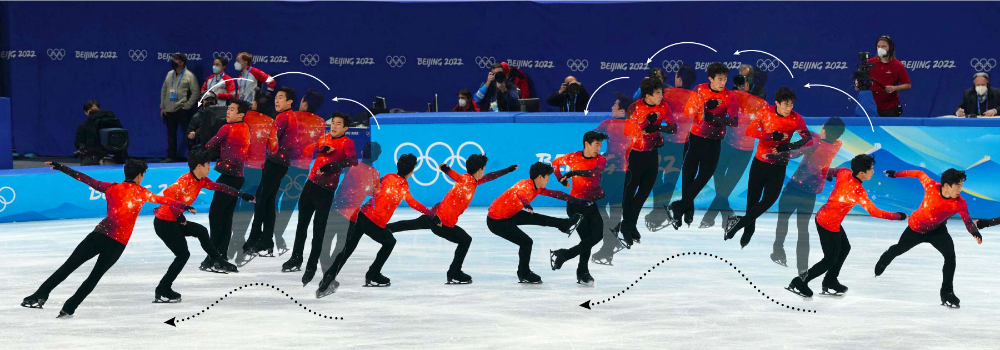

### Background to Figure Skating Video

If you are unfamiliar with Figure Skating Scoring, please watch this video:

<iframe width="560" height="315" src="https://www.youtube.com/embed/i6pw07k3GkM?si=ud_nUmub-iDQ_cAm" title="YouTube video player" frameborder="0" allow="accelerometer; autoplay; clipboard-write; encrypted-media; gyroscope; picture-in-picture; web-share" referrerpolicy="strict-origin-when-cross-origin" allowfullscreen>

</iframe>

### Introduction to Module

Figure skating is a sport where athletes perform choreographed routines on ice to music, combining athletic skill with artistic expression. Skaters compete in different categories like men's singles, women's singles, pairs (a man and a woman skating together), and ice dance (which focuses more on rhythm and movement). Each skater or team performs two routines: the short program and the free skate. The short program is a shorter routine with a list of required moves that every skater must include. Judges rate how well each move is done and how smoothly everything fits with the music. The free skate routine is longer and gives skaters more freedom to show their personal style and creativity. They still need to include certain types of moves, but they can choose how to put them together. Judges give scores for both routines based on how difficult the moves are, how well they’re done, and how artistic the performance is. The scores from both routines are added together, and the skater or team with the highest total wins.

The `MensFigureSkating` dataset features data from male skaters in the winter Olympics since 2006. Variables include characteristics such as Name, Nation, Year. Other variables included the 3 types of scoring: Free Skate, Short Program, and Total Points. The relevant variables for this specific module are Total Points and Year.

For the sake of this module, the data set was tidied so that it excluded any skater who did not advance to the Free Skate round.

::: {.callout-note collapse="true" title="Learning Objectives" appearance="minimal"}
Learning Objectives:

1.  Students will learn when and how to use One-Way ANOVA

2.  Students will learn how to perform a pair wise comparison such as Post Hoc Tukey Test

3.  Students will gain a further understanding of interpreting graphs and outputs
:::

::: {.callout-note collapse="true" title="Methods" appearance="minimal"}
Intended as a reinforcement module, students should be exposed to ANOVA prior to the module. In particular, students are expected to have been exposed to the concept of hypothesis forming, rejecting hypothesis, confidence intervals and interpreting output. Students are also expected to now how to construct basic plots, fit ANOVA models, and use software (such as R or Minita) to produce said results.
:::

::: {.callout-note collapse="true" title="Activity Length" appearance="minimal"}
This activity would be suitable for an in-class activity or as an out-of-class assignment taking approximately one class period.
:::

::: {.callout-note collapse="true" title="Technology Requirements" appearance="minimal"}
For this activity, students will need to a statistical software capable of producing ANOVA output with Tukey's HSD. Materials are provided both for using `R` as well as a a handout that is software agnostic.
:::

### Data

The `MensFigureSkating.csv` data contains scores from skaters in the Winter Olympics since 2006.

Download data: [MensFigureSkating.csv](MensFigureSkating.csv)

<b>Variable Descriptions</b>

| Variable | Description                   |
|----------|-------------------------------|
| Rank     | Rank of the skater            |
| Name     | Name of the skater            |
| Nation   | Country skater represents     |
| TP       | Total points scored (SP + FS) |
| SP       | Short Program score           |
| FS       | Free Skate Score              |
| Year     | Year of Olympics              |

Additional details related to the data are available on the [SCORE Data Repository](https://data.scorenetwork.org/skating/figure_skating_olympics.html){target="_blank"}

### Materials

Class Handout

-   [R/Quarto Version](FigureSkatingANOVA_Worksheet.qmd)
-   [MS Word Version](FigureSkatingANOVA_Worksheet.docx)

Solutions

-   [R/Quarto Version](FigureSkatingANOVA_Worksheet_Solutions.qmd)
-   [PDF Version](FigureSkatingANOVA_Worksheet_Solutions.pdf)

::: {.callout-note collapse="true" title="Conclusion" appearance="minimal"}
Students should gain an understanding of how the process of One-way ANOVA and Pair-wise Comparisons (such as Post Hoc Tukey test) works.
:::
